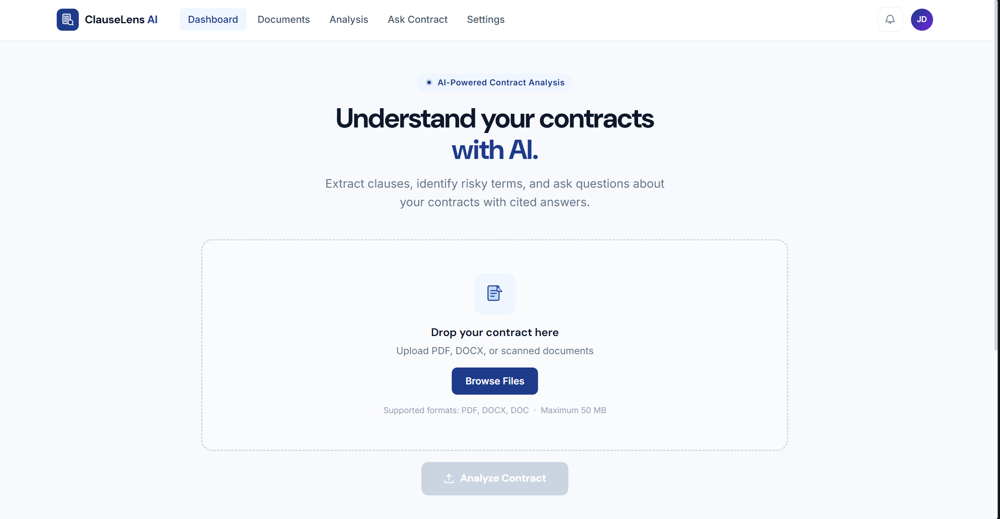
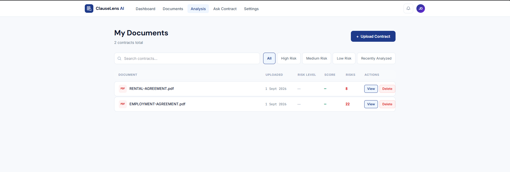
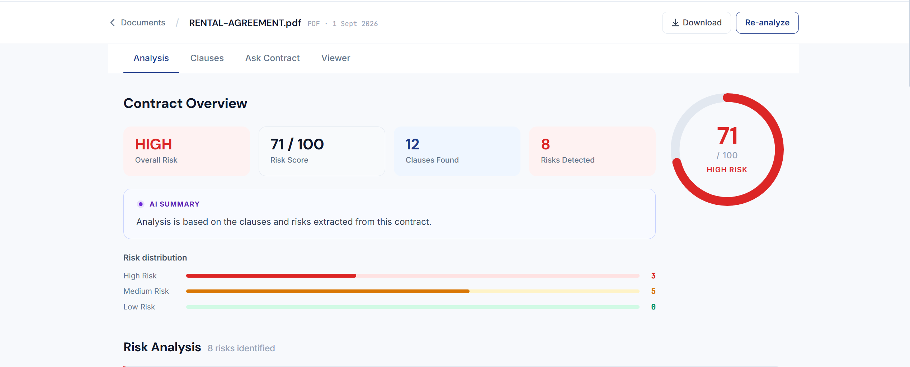
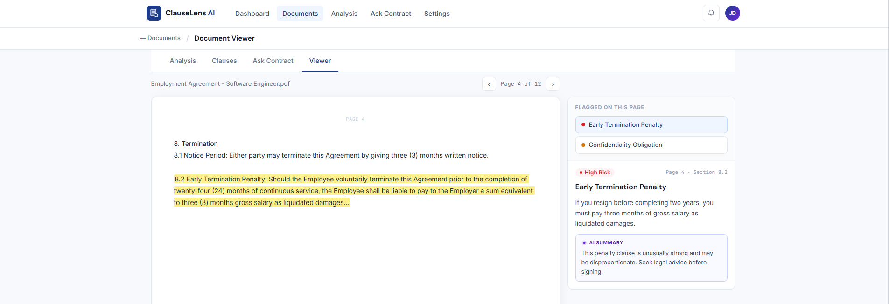
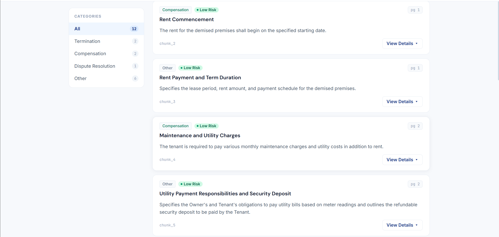
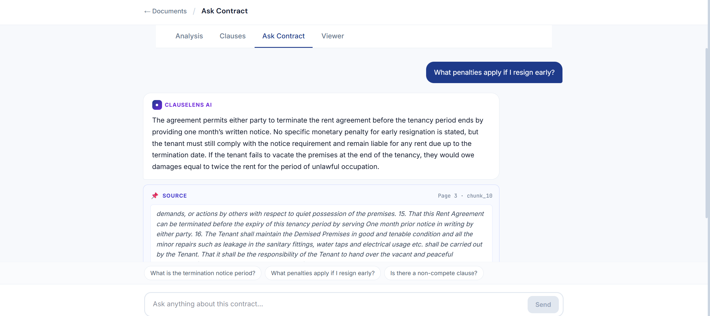
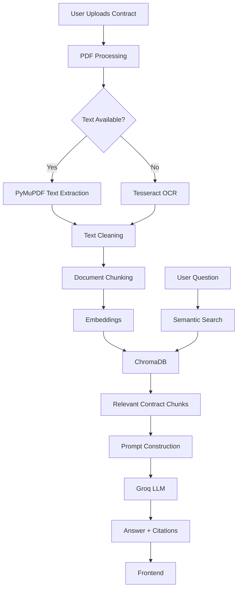
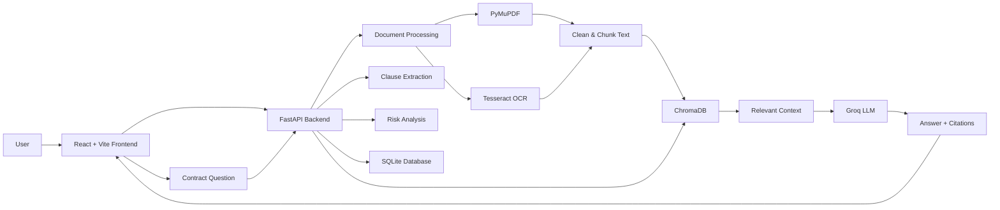
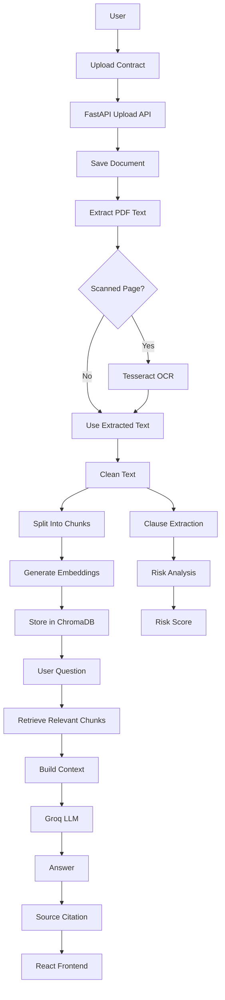

# ⚖️ ClauseLens AI

### AI-Powered Legal Contract Analysis & RAG Assistant

> **Understand every clause. Spot every risk.**

ClauseLens AI is an AI-powered legal contract analysis platform designed to help users understand complex legal documents.

The application allows users to upload contracts, extract text using PDF processing and OCR, identify important contractual clauses, detect potentially risky terms, generate risk scores, and ask natural-language questions about their contracts.

ClauseLens AI uses **Retrieval-Augmented Generation (RAG)** with **ChromaDB** for contextual retrieval and **Groq** for AI-powered responses.

---

## 📸 Project Preview

> Add your project screenshots in the `docs/images/` directory and update the filenames below.

### 🏠 Dashboard



### 📄 Contract Upload



### 📊 Contract Analysis



### ⚠️ Risk Analysis



### 📑 Extracted Clauses



### 💬 AI Contract Assistant



---

# 🚀 Features

## 📄 Contract Upload

Upload legal contracts in PDF format for automated analysis.

The system processes both:

- Digital PDFs
- Scanned/image-based PDFs

---

## 🔍 Text Extraction & OCR

ClauseLens AI first attempts normal PDF text extraction.

If a page contains little or no extractable text, the system uses **Tesseract OCR** to extract text from the scanned page.

```text
PDF
 │
 ├── Digital PDF
 │       ↓
 │   PyMuPDF
 │
 └── Scanned PDF
         ↓
     Tesseract OCR
```

---

## 📑 Clause Extraction

The system identifies important contractual clauses, including:

- Termination
- Compensation
- Confidentiality
- Intellectual Property
- Non-Compete
- Payment
- Notice Period
- Dispute Resolution
- Obligations
- Penalties

---

## ⚠️ Risk Detection

ClauseLens AI analyzes contractual terms and identifies potentially risky provisions.

Risk levels can include:

```text
🔴 High Risk
🟡 Medium Risk
🟢 Low Risk
```

The system also generates an overall contract risk score.

Example:

```text
Overall Risk: HIGH

Risk Score: 78 / 100

Clauses: 14

Risks Detected: 5
```

---

## 💬 Ask Your Contract

Users can ask natural-language questions about uploaded contracts.

Examples:

```text
What is the termination notice period?
```

```text
What happens if I resign before completing the required period?
```

```text
Is there a non-compete clause?
```

```text
What penalties are mentioned in the contract?
```

```text
Who owns the intellectual property?
```

```text
What are the confidentiality obligations?
```

The system retrieves relevant contract content before sending the context to the LLM.

---

## 📌 Citations

AI-generated answers are grounded in retrieved contract content.

Where available, the system provides source information such as:

- Page number
- Relevant contract section
- Retrieved source context

Example:

```text
Answer:
The employee must provide 30 days' notice before termination.

Source:
Page 4
```

This allows users to verify the generated answer against the original contract.

---

# 🧠 RAG Architecture

ClauseLens AI uses **Retrieval-Augmented Generation (RAG)** to retrieve relevant information from the uploaded contract before generating an answer.



---

# 🏗️ System Architecture



---

# 🔄 Complete Application Flow



---

# 🛠️ Technology Stack

## Frontend

| Technology | Purpose |
|---|---|
| React | User interface |
| TypeScript | Type-safe frontend development |
| Vite | Frontend development and build tool |
| HTML/CSS | UI structure and styling |

---

## Backend

| Technology | Purpose |
|---|---|
| Python | Backend programming language |
| FastAPI | REST API framework |
| Uvicorn | ASGI server |
| SQLAlchemy | Database ORM |

---

## AI & RAG

| Technology | Purpose |
|---|---|
| Groq | Large Language Model API |
| ChromaDB | Vector database |
| RAG | Context retrieval and grounded generation |

---

## Document Processing

| Technology | Purpose |
|---|---|
| PyMuPDF | PDF text extraction |
| Tesseract OCR | Scanned document OCR |
| Pillow | Image processing |

---

## Database

| Technology | Purpose |
|---|---|
| SQLite | Local application database |
| SQLAlchemy | Database interaction |

---

# 📂 Project Structure

```text
ClauseLens-AI/
│
├── backend/
│   │
│   ├── app/
│   │   │
│   │   ├── api/
│   │   │   ├── upload.py
│   │   │   ├── chat.py
│   │   │   ├── analysis.py
│   │   │   ├── clauses.py
│   │   │   └── risks.py
│   │   │
│   │   ├── services/
│   │   │   ├── ocr_service.py
│   │   │   ├── document_processor.py
│   │   │   ├── vector_service.py
│   │   │   ├── search_service.py
│   │   │   ├── llm_service.py
│   │   │   ├── clause_service.py
│   │   │   └── risk_service.py
│   │   │
│   │   ├── database/
│   │   │   ├── database.py
│   │   │   └── models.py
│   │   │
│   │   └── main.py
│   │
│   └── requirements.txt
│
├── frontend/
│   │
│   ├── src/
│   │   ├── components/
│   │   ├── pages/
│   │   ├── services/
│   │   │   └── api.ts
│   │   ├── App.tsx
│   │   └── main.tsx
│   │
│   ├── public/
│   ├── package.json
│   ├── package-lock.json
│   ├── vite.config.ts
│   └── tsconfig.json
│
├── docs/
│   └── images/
│       ├── dashboard.png
│       ├── upload.png
│       ├── analysis.png
│       ├── risks.png
│       ├── clauses.png
│       └── chat.png
│
├── uploads/
├── chroma_db/
├── data/
│
├── .env.example
├── .gitignore
└── README.md
```

> `uploads/`, `chroma_db/`, `data/`, databases, environment files, and other generated files should not be committed to GitHub.

---

# 💻 Local Installation

## Prerequisites

Before running ClauseLens AI locally, install:

- Python 3.12
- Node.js 18 or later
- npm
- Git
- Tesseract OCR
- A Groq API key

---

# 1️⃣ Clone the Repository

```bash
git clone https://github.com/YOUR_USERNAME/ClauseLens-AI.git
```

Navigate into the project:

```bash
cd ClauseLens-AI
```

---

# 2️⃣ Backend Setup

Open a terminal in the project directory.

```bash
cd backend
```

Create a Python virtual environment:

### Windows

```powershell
python -m venv venv
```

Activate it:

```powershell
.\venv\Scripts\Activate.ps1
```

If PowerShell prevents activation, you can use:

```powershell
venv\Scripts\activate.bat
```

### Linux / macOS

```bash
python3 -m venv venv
```

Activate:

```bash
source venv/bin/activate
```

---

# 3️⃣ Install Python Dependencies

Make sure the virtual environment is activated.

Run:

```bash
pip install -r requirements.txt
```

Verify:

```bash
pip list
```

---

# 4️⃣ Install Tesseract OCR

ClauseLens AI uses Tesseract OCR to process scanned PDF documents.

## Windows

Install Tesseract OCR.

A common installation location is:

```text
C:\Program Files\Tesseract-OCR\
```

Verify the installation:

```powershell
tesseract --version
```

You should see the installed Tesseract version.

If Windows reports:

```text
'tesseract' is not recognized
```

add the Tesseract installation directory to your Windows PATH.

---

## Linux

On Debian/Ubuntu-based systems:

```bash
sudo apt update
sudo apt install tesseract-ocr
```

Verify:

```bash
tesseract --version
```

---

## macOS

Using Homebrew:

```bash
brew install tesseract
```

Verify:

```bash
tesseract --version
```

---

# 5️⃣ Configure Groq API

ClauseLens AI uses Groq for AI-powered contract question answering.

Create a `.env` file in the project root:

```text
ClauseLens-AI/
│
├── .env
├── backend/
└── frontend/
```

Add:

```env
GROQ_API_KEY=your_groq_api_key_here
```

Replace the placeholder with your own Groq API key.

### Important

Never commit your `.env` file.

The repository provides:

```text
.env.example
```

as a template.

---

# 6️⃣ Backend Environment Check

From the backend directory, verify that Python can access the environment and application modules.

```powershell
python -c "import os; from dotenv import load_dotenv; load_dotenv(); print('GROQ API configured:', bool(os.getenv('GROQ_API_KEY')))"
```

Expected output:

```text
GROQ API configured: True
```

Do not print the actual API key.

---

# 7️⃣ Start the Backend

From:

```text
ClauseLens-AI/backend
```

run:

```powershell
uvicorn app.main:app --reload
```

The backend should start at:

```text
http://127.0.0.1:8000
```

---

## FastAPI Documentation

Open:

```text
http://127.0.0.1:8000/docs
```

FastAPI provides an interactive Swagger interface where you can test the API endpoints.

---

# 8️⃣ Frontend Setup

Open a **second terminal**.

Navigate to the frontend:

```powershell
cd ClauseLens-AI\frontend
```

Install Node dependencies:

```powershell
npm install
```

---

# 9️⃣ Configure Frontend API URL

If your frontend uses an environment variable, create:

```text
frontend/.env
```

Add:

```env
VITE_API_URL=http://localhost:8000
```

Your frontend API service should use the variable:

```typescript
const API_URL =
  import.meta.env.VITE_API_URL ||
  "http://localhost:8000";
```

Do not commit:

```text
frontend/.env
```

to GitHub.

---

# 🔟 Start the Frontend

From:

```text
ClauseLens-AI/frontend
```

run:

```powershell
npm run dev
```

Vite will normally start at:

```text
http://localhost:5173
```

Open the URL in your browser.

---

# ▶️ Running the Complete Application

ClauseLens AI currently requires two terminals.

## Terminal 1 — Backend

```powershell
cd ClauseLens-AI\backend
.\venv\Scripts\Activate.ps1
uvicorn app.main:app --reload
```

Backend:

```text
http://127.0.0.1:8000
```

---

## Terminal 2 — Frontend

```powershell
cd ClauseLens-AI\frontend
npm run dev
```

Frontend:

```text
http://localhost:5173
```

---

# 🔗 Application URLs

| Service | URL |
|---|---|
| Frontend | http://localhost:5173 |
| Backend | http://127.0.0.1:8000 |
| API Documentation | http://127.0.0.1:8000/docs |

---

# 📄 Using ClauseLens AI

## Step 1 — Upload a Contract

Upload a PDF contract through the frontend.

```text
User
 ↓
Upload PDF
 ↓
FastAPI
```

---

## Step 2 — Document Processing

The backend processes the document.

```text
PDF
 ↓
Text Extraction
 ↓
OCR if required
 ↓
Text Cleaning
```

---

## Step 3 — RAG Indexing

The extracted text is divided into smaller chunks.

```text
Clean Text
 ↓
Chunking
 ↓
Embeddings
 ↓
ChromaDB
```

---

## Step 4 — Contract Analysis

The application analyzes the contract for:

```text
Clauses
   +
Potential Risks
   +
Risk Score
```

---

## Step 5 — Ask Questions

Users can ask questions about the uploaded contract.

Example:

```text
What happens if I leave before completing the required period?
```

The system:

```text
Question
   ↓
ChromaDB Search
   ↓
Relevant Contract Context
   ↓
Groq
   ↓
Answer + Citation
```

---

# 💬 Example Questions

Try the following questions after uploading a contract:

### Termination

```text
What is the termination notice period?
```

### Early Departure

```text
What happens if I resign before completing the required period?
```

### Non-Compete

```text
Is there a non-compete clause?
```

### Confidentiality

```text
What are my confidentiality obligations?
```

### Intellectual Property

```text
Who owns the intellectual property created during employment?
```

### Penalties

```text
What penalties are mentioned in the contract?
```

### Compensation

```text
What is the compensation structure?
```

### Disputes

```text
How are disputes resolved?
```

---

# ⚠️ Risk Analysis

ClauseLens AI attempts to identify contractual provisions that may deserve additional attention.

Example categories include:

```text
Early Termination
Non-Compete
Financial Penalties
Long Notice Period
Broad Confidentiality
Intellectual Property Transfer
Automatic Renewal
```

Example result:

```text
Risk Level: HIGH

Risk Score: 78 / 100

Issue:
Early termination may result in a financial obligation.

Source:
Page 4
```

---

# 🗄️ Local Data

The application may generate local files/directories such as:

```text
uploads/
```

for uploaded documents,

```text
chroma_db/
```

for vector data,

and:

```text
data/
```

for local database files.

These should remain local and should not be committed to GitHub.

---

# 🔐 Environment Variables

## Backend

Create:

```text
.env
```

Example:

```env
GROQ_API_KEY=your_groq_api_key
```

## Frontend

Create:

```text
frontend/.env
```

Example:

```env
VITE_API_URL=http://localhost:8000
```

### Never expose your Groq API key in frontend code.

The Groq API key should only be used by the backend.

---

# 🧪 Testing the Backend

You can test the backend through Swagger:

```text
http://127.0.0.1:8000/docs
```

You can also test individual endpoints using tools such as:

- Swagger UI
- Postman
- cURL
- Frontend application

---

# 🔧 Troubleshooting

## Tesseract Not Found

If you see:

```text
TesseractNotFoundError
```

or:

```text
tesseract.exe is not installed or it's not in your PATH
```

verify:

```powershell
tesseract --version
```

If it isn't recognized, add the Tesseract installation directory to your PATH.

---

## Groq API Error

If you see:

```text
GROQ_API_KEY is missing
```

check that `.env` contains:

```env
GROQ_API_KEY=your_key
```

and that you are loading environment variables using `python-dotenv`.

---

## ChromaDB Error

If ChromaDB cannot create or access its storage directory, make sure the directory exists and the application has permission to write to it.

Example:

```text
chroma_db/
```

---

## FastAPI Import Error

If you see:

```text
ModuleNotFoundError: No module named 'app'
```

make sure you are running Uvicorn from the `backend` directory:

```powershell
cd backend
uvicorn app.main:app --reload
```

---

## Frontend Cannot Connect to Backend

Check that the backend is running:

```text
http://127.0.0.1:8000/docs
```

Then check the frontend environment variable:

```env
VITE_API_URL=http://localhost:8000
```

Restart Vite after changing `.env`.

```powershell
npm run dev
```

---

# 🛡️ Security Considerations

ClauseLens AI is intended to work with potentially sensitive legal documents.

Before production deployment, additional security controls should be implemented.

Recommended improvements include:

- User authentication
- User-specific document access
- HTTPS
- Secure file storage
- File type validation
- File size limits
- Rate limiting
- API authentication
- Secure document deletion
- Access control
- Protection against prompt injection
- Sensitive data handling
- Audit logging

Never commit:

```text
.env
```

or API keys to GitHub.

---

# ⚠️ Legal Disclaimer

ClauseLens AI is an **informational contract-analysis tool**.

It does not provide legal advice and should not be considered a replacement for a qualified lawyer or legal professional.

AI-generated results may contain errors or omissions.

Users should verify important information against the original contract and consult a qualified legal professional for legal decisions.

---

# 🔮 Future Scope

## Authentication

Add:

```text
User Registration
        ↓
Login
        ↓
Personal Dashboard
        ↓
Private Documents
```

---

## 📚 Multi-Contract Comparison

Allow users to compare multiple contracts.

```text
Contract A
     +
Contract B
     ↓
Clause Comparison
     ↓
Differences
     ↓
Risk Comparison
```

---

## 📊 Advanced Risk Scoring

Improve risk scoring using:

- Clause severity
- Financial exposure
- Duration
- Obligations
- Contract type
- User-defined risk preferences

---

## 🖍️ PDF Citation Highlighting

Allow users to click a citation and jump directly to the relevant section of the original PDF.

---

## 📥 Report Export

Allow users to export:

```text
Contract Summary
+
Extracted Clauses
+
Risk Analysis
+
AI Answers
+
Citations
```

as a downloadable report.

---

## 🌐 Multi-Language Support

Future versions can support contracts in multiple languages using multilingual OCR and language models.

---

## 🐘 Production Database

The current project uses SQLite for local development.

A production version can migrate to:

```text
PostgreSQL
```

and potentially use:

```text
pgvector
```

for vector search.

---

# 🚀 Deployment

The current repository is configured primarily for local development.

A future production architecture can use:

```text
                   Internet
                      │
                      ▼
               React + Vite
                 Frontend
                      │
                   HTTPS
                      │
                      ▼
                FastAPI API
                      │
        ┌─────────────┼─────────────┐
        │             │             │
        ▼             ▼             ▼
      Groq        ChromaDB      PostgreSQL
                      │
                      ▼
                  RAG Search
```

Possible hosting options include:

- Vercel for the frontend
- Railway or Render for the backend
- PostgreSQL for production data
- Object storage for uploaded documents

---

# 🤝 Contributing

Contributions are welcome.

## 1. Fork the repository

Create your own fork of ClauseLens AI.

## 2. Clone your fork

```bash
git clone https://github.com/YOUR_USERNAME/ClauseLens-AI.git
cd ClauseLens-AI
```

## 3. Create a feature branch

```bash
git checkout -b feature/your-feature
```

## 4. Make your changes

Implement and test your changes locally.

## 5. Commit

```bash
git add .
git commit -m "Add your feature"
```

## 6. Push

```bash
git push origin feature/your-feature
```

## 7. Open a Pull Request

Submit a Pull Request describing your changes.

---

# 📸 Adding Project Screenshots

Create the following directory:

```text
docs/images/
```

Place your screenshots there:

```text
docs/
└── images/
    ├── dashboard.png
    ├── upload.png
    ├── analysis.png
    ├── risks.png
    ├── clauses.png
    └── chat.png
```

Then reference them in this README:

```markdown
## 📸 Project Preview

### Dashboard


### Contract Upload


### Contract Analysis


### Risk Analysis


### Extracted Clauses


### AI Contract Assistant


```

### Screenshot recommendation

For a professional GitHub page, add screenshots showing:

1. **Landing/Dashboard**
2. **PDF upload**
3. **Contract analysis**
4. **Risk score**
5. **Extracted clauses**
6. **Chat question**
7. **Answer with citation**

Make sure screenshots do not contain real personal information or confidential contracts.

---

# 📌 Project Status

```text
Frontend             ✅ React + Vite + TypeScript
Backend              ✅ FastAPI
PDF Processing       ✅ PyMuPDF
OCR                  ✅ Tesseract
Vector Database      ✅ ChromaDB
LLM                  ✅ Groq
RAG                  ✅ Implemented
Clause Extraction    ✅ Implemented
Risk Analysis        ✅ Implemented
SQLite Database      ✅ Implemented
Authentication       🔜 Planned
Multi-contract RAG   🔜 Planned
PDF Highlighting     🔜 Planned
Cloud Deployment     🔜 Planned
```

---

# 📄 License

This project is currently intended for educational and portfolio purposes.

A formal open-source license can be added to the repository in the future.

---

# 👨‍💻 About ClauseLens AI

ClauseLens AI combines:

```text
OCR
+
Document Processing
+
Vector Search
+
RAG
+
Large Language Models
+
Clause Extraction
+
Risk Analysis
```

to create an intelligent contract-analysis assistant.

---

## ⚖️ ClauseLens AI

### Understand every clause. Spot every risk.

Built with:

**React • TypeScript • Vite • FastAPI • Python • ChromaDB • Groq • Tesseract OCR • SQLite**